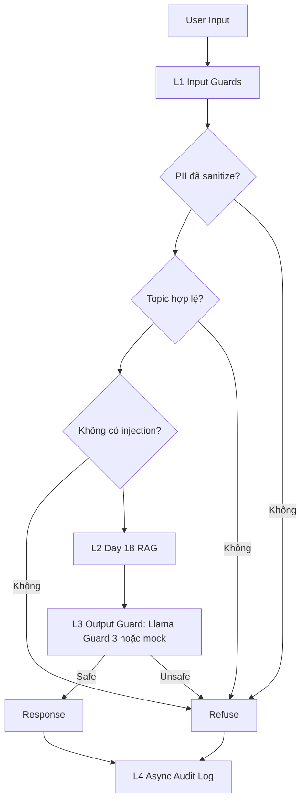

# Blueprint triển khai production cho Lab 24

## SLOs

| Metric | Target | Ngưỡng cảnh báo | Severity |
|---|---:|---:|---|
| Faithfulness | >= 0.85 | < 0.80 trong 30 phút | P2 |
| Answer Relevancy | >= 0.80 | < 0.75 trong 30 phút | P2 |
| Context Precision | >= 0.70 | < 0.65 trong 1 giờ | P3 |
| Context Recall | >= 0.75 | < 0.70 trong 1 giờ | P3 |
| P95 latency có guardrails | < 2.5s | > 3s trong 5 phút | P1 |
| Guardrail Detection Rate | >= 90% | < 85% | P2 |
| False Positive Rate | < 5% | > 10% | P2 |

## Kiến trúc

Latency budget: L1 target P95 < 50ms, L2 phụ thuộc retrieval/generation model, L3 target P95 < 100ms nếu dùng hosted guard, L4 chạy fire-and-forget nên không tính vào latency chính.

## Snapshot eval hiện tại

Lần đo mới nhất, ngày 2026-05-12:

| Hạng mục | Giá trị |
|---|---|
| Loại chạy | Real RAG + real RAGAS |
| Cỡ mẫu | 3 câu hỏi |
| LLM/Judge | `gpt-4o-mini` |
| Embeddings | `text-embedding-3-small`, 768 dimensions |
| Reranker | Tắt để ổn định trên Windows |
| Giới hạn context eval | 2 contexts x 1200 ký tự |
| Runtime | Khoảng 5.5 phút |

| Metric | Score | Trạng thái |
|---|---:|---|
| Faithfulness | 0.533 | Dưới SLO |
| Answer Relevancy | 0.524 | Dưới SLO |
| Context Precision | 0.667 | Gần target |
| Context Recall | 0.667 | Gần target |

Điểm thấp chủ yếu do một câu hỏi số liệu/bảng BCTC: hệ thống abstain thay vì trả về số tiền thuế GTGT. Đây là finding của evaluation/retrieval, không phải lỗi guardrail.

## Alert playbook

### Sự cố: Faithfulness giảm dưới 0.80

**Severity:** P2

**Detection:** RAGAS continuous eval hoặc scheduled CI eval.

**Nguyên nhân có thể:** retriever trả về context yếu, prompt thay đổi, hoặc corpus được cập nhật nhưng chưa re-index.

**Điều tra:** so sánh context precision/recall cùng thời điểm, kiểm tra diff prompt/config gần nhất, xem log cập nhật tài liệu.

**Xử lý:** re-index corpus, rollback prompt thay đổi, hoặc tăng rerank/top-k cho source bị ảnh hưởng.

### Sự cố: P95 latency vượt 3 giây

**Severity:** P1

**Detection:** latency benchmark hoặc production telemetry.

**Nguyên nhân có thể:** RAG generation chậm, API Groq/OpenAI chậm, reranker cold start, hoặc concurrency quá cao.

**Điều tra:** tách timing theo L1/L2/L3, kiểm tra trạng thái API, xem log load reranker.

**Xử lý:** dùng fallback/mock cho smoke test, giảm concurrency, cache embeddings/index, hoặc route sang model nhanh hơn.

### Sự cố: False positive của guardrail vượt 10%

**Severity:** P2

**Detection:** review audit log và validation set đã label.

**Nguyên nhân có thể:** danh sách keyword topic quá hẹp, bỏ sót phrasing tiếng Việt, hoặc Llama Guard over-block.

**Điều tra:** lấy mẫu request bị block, tách topic block khỏi output block, so sánh với human labels.

**Xử lý:** mở rộng allowed topic keywords, tune refusal rules, và chỉ block cứng với injection/unsafe detection có confidence cao.

## Phân tích chi phí

Giả định: 100k queries/tháng, sample continuous eval 1%, CI chỉ chạy smoke rẻ.

| Component | Unit Cost | Volume | Monthly Cost |
|---|---:|---:|---:|
| RAG generation với mini model | $0.001/query | 100k | $100 |
| RAGAS continuous eval | $0.01/query | 1k | $10 |
| Pairwise judge sample | $0.001/query | 10k | $10 |
| Higher-quality judge audit | $0.05/query | 1k | $50 |
| Presidio và regex input guard | $0 | 100k | $0 |
| Groq/Llama Guard API sample | usage-based | 10k | phụ thuộc tier |

Kế hoạch tối ưu: giữ CI ở `--mock-rag --skip-ragas`, chạy real RAGAS theo từng nấc 3-5 câu trước khi thử 50 câu, giới hạn context khi judge bằng RAGAS, và chỉ dùng Groq Llama Guard cho validation output safety hoặc production traffic. Trước khi chạy lớn nên cache enrichment/index vì hiện tại mỗi lần rebuild lặp lại 26 enrichment calls.
